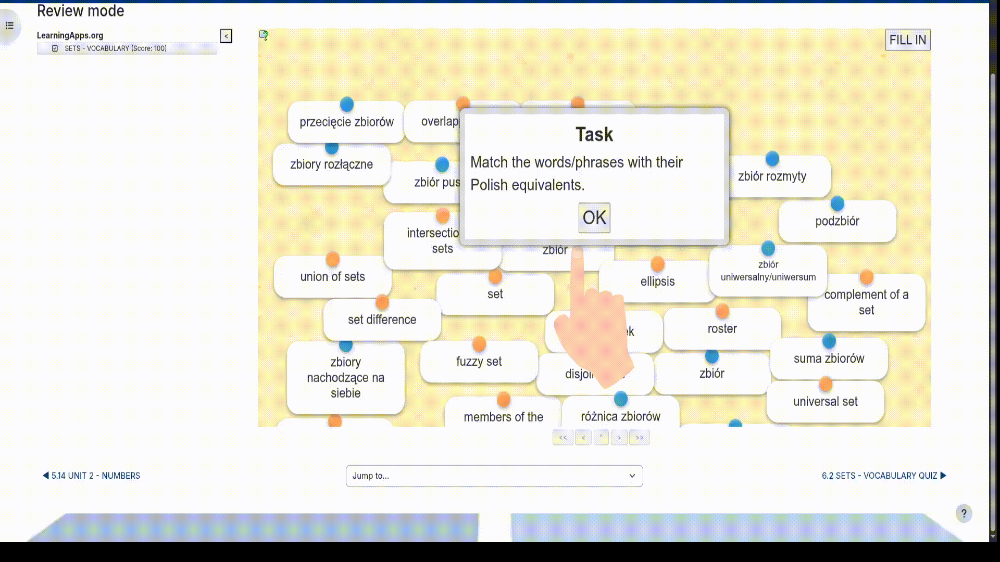

# INSTALACJA:
## Dla chromium:
1) Pobierasz to repo
2) Wchodzisz w ustawienia wtyczek
3) Włączasz developer mode 
4) Klikasz "Load unpacked" 
5) Wybierasz folder z tym rozszerzeniem i się cieszysz 
## Dla firefox:
- Tu nie jest tak łatwo, może kiedyś podpiszę i tu wstawię ten plik

# PRZYKŁADY
## Dopasowanie kart:
 
## Rozwiązanie quizu:
 
## Pobieranie wideo:

