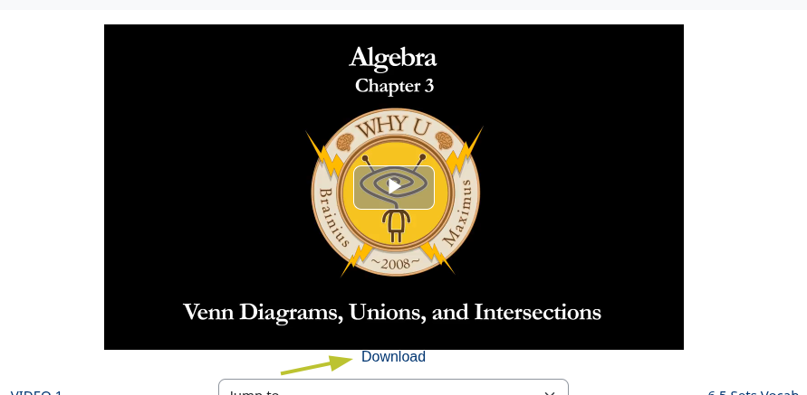
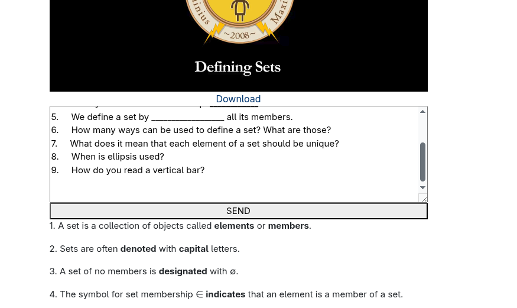
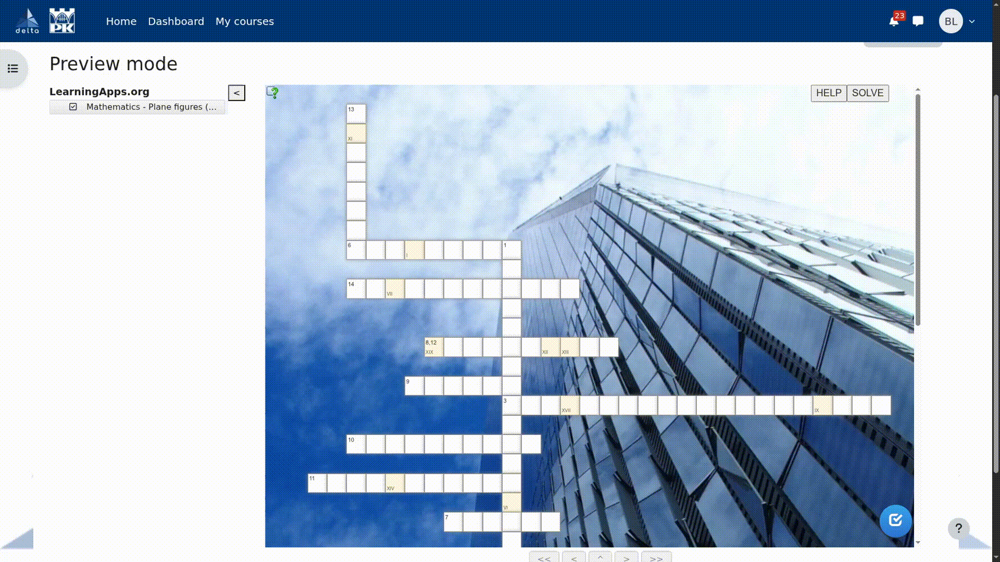
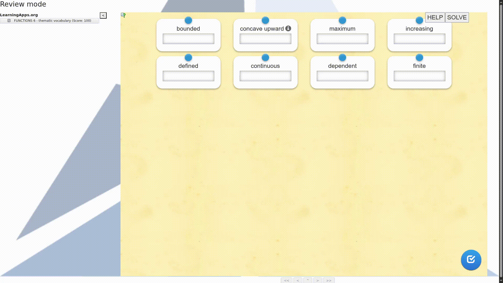
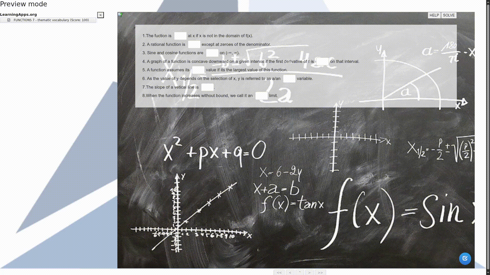
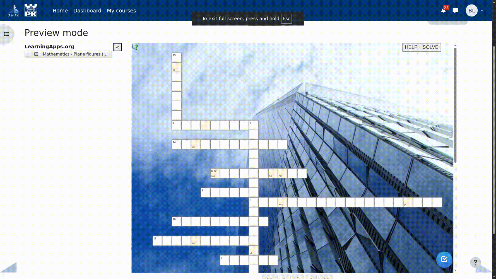

	

# INSTALACJA:
## Dla chromium:
1) Pobierasz najnowszy `.zip` [release](https://github.com/GieniuG/deltaPremium/releases) (lub to repo)
3) Rozpakujesz plik zip
2) Wchodzisz w ustawienia wtyczek
3) Włączasz developer mode 
4) Klikasz "Load unpacked" 
5) Wybierasz folder z tym rozszerzeniem i się cieszysz 
## Dla firefox:
1) Pobierasz najnowszy `.xpi` [release](https://github.com/GieniuG/deltaPremium/releases)
2) Wchodzisz w ustawienia wtyczek
3) Install Add-on From File
4) Wybierasz plik .xpi
5) Klikasz "Add"

# FUNKCJE
## POBIERANIE WIDEO:

## ODPOWIADANIE NA PYTANIA NA PODSTAWIE WIDEO:

> [!IMPORTANT]
> Ta funkcja działa tylko gdy podane jest prawidłowe API do gemini które można zdobyć tutaj totalnie za **darmo** [https://aistudio.google.com/app/apikey](https://aistudio.google.com/app/apikey )

## AUTO UZUPERŁNIANIE:
### Dopasowanie kart:
 
### Rozwiązanie quizu:
 
### Rozwiązywanie krzyżówki:
 
### Przeciwieństwa:
 
### Wybieranie z listy:
 
## POMOC:
### Dopasowanie kart:
 
### Rozwiązanie quizu:
 
### Wordle:
 
### Rozwiązywanie krzyżówki:
 

 https://aistudio.google.com/app/apikey
