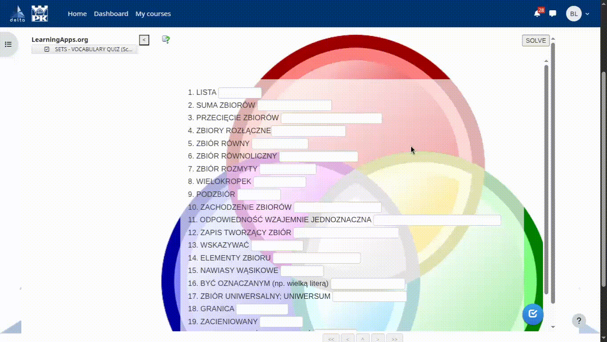
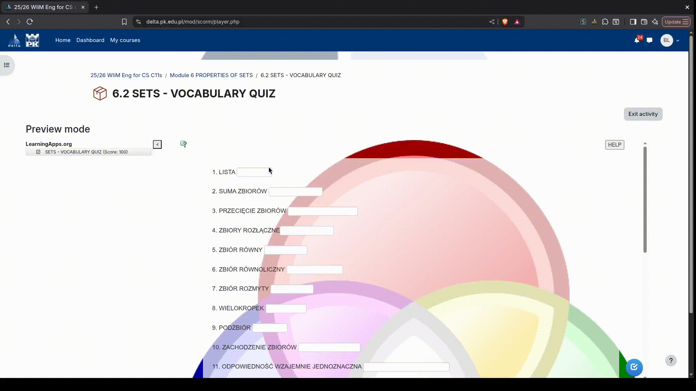
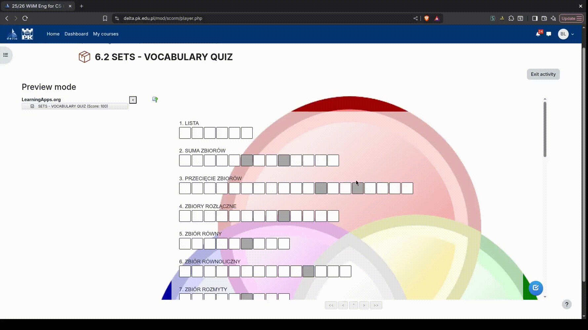

	

# INSTALACJA:
## Dla chromium:
1) Pobierasz to najnowszy  (lub to repo)
3) Rozpakujesz plik zip
2) Wchodzisz w ustawienia wtyczek
3) Włączasz developer mode 
4) Klikasz "Load unpacked" 
5) Wybierasz folder z tym rozszerzeniem i się cieszysz 
## Dla firefox:
1) Pobierasz to najnowszy 
2) Wchodzisz w ustawienia wtyczek
3) Install Add-on From File
4) Wybierasz plik .xpi
5) Klikasz "Add"

# FUNKCJE
## POBIERANIE WIDEO:

## AUTO UZUPERŁNIANIE:
### Dopasowanie kart:
 
### Rozwiązanie quizu:
 
### Rozwiązywanie krzyżówki:
 
### Przeciwieństwa:
 
### Wybieranie z listy:
 
## POMOC:
### Dopasowanie kart:
 
### Rozwiązanie quizu:
 
### Wordle:
 
### Rozwiązywanie krzyżówki:
 
