# POBIERANIE WIDEO:
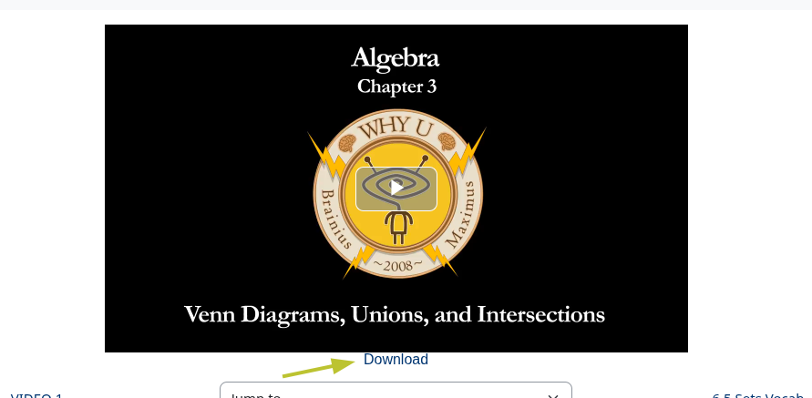
# ODPOWIADANIE NA PYTANIA NA PODSTAWIE WIDEO:
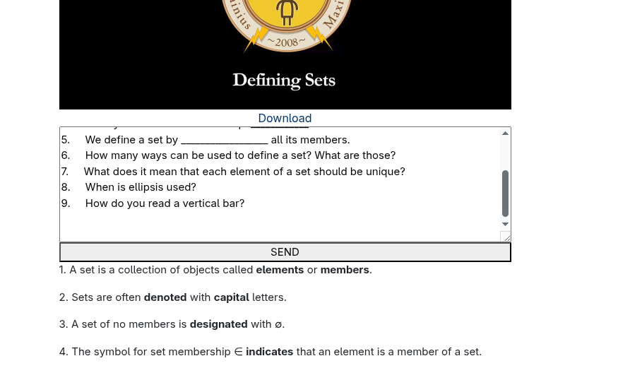
> [!IMPORTANT]
> Ta funkcja działa tylko gdy podane jest prawidłowe API do gemini które można zdobyć tutaj totalnie za **darmo** [https://aistudio.google.com/app/apikey](https://aistudio.google.com/app/apikey )

# AUTO UZUPERŁNIANIE:
## Dopasowanie kart:
 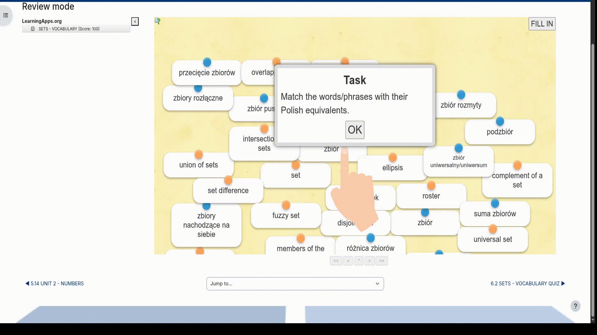
## Rozwiązanie quizu:
 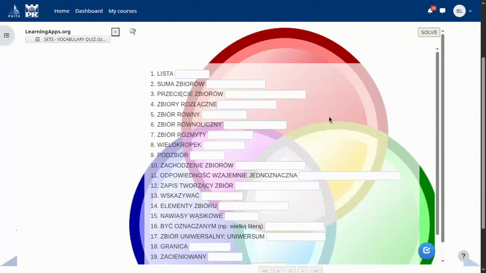
## Rozwiązywanie krzyżówki:
 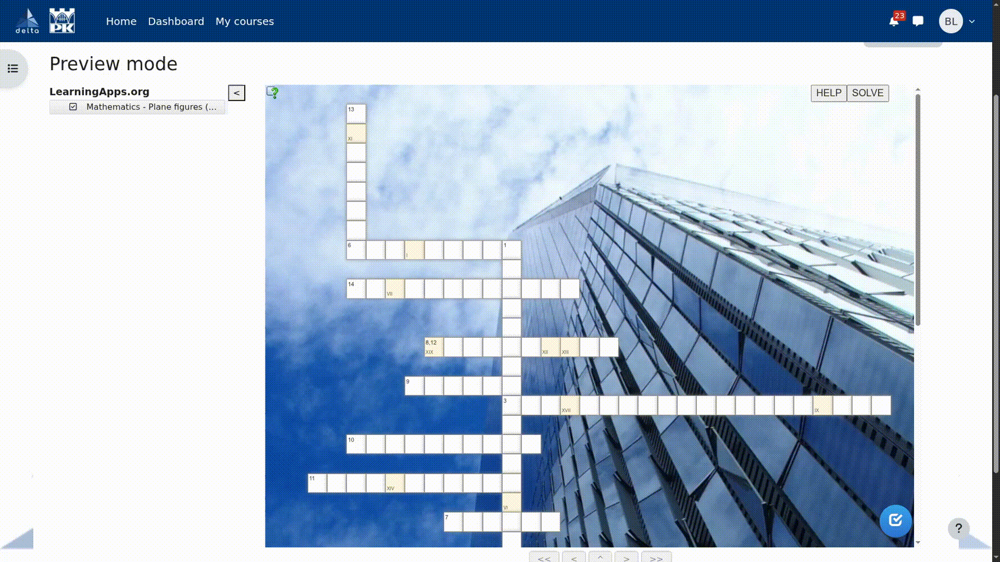
## Przeciwieństwa:
 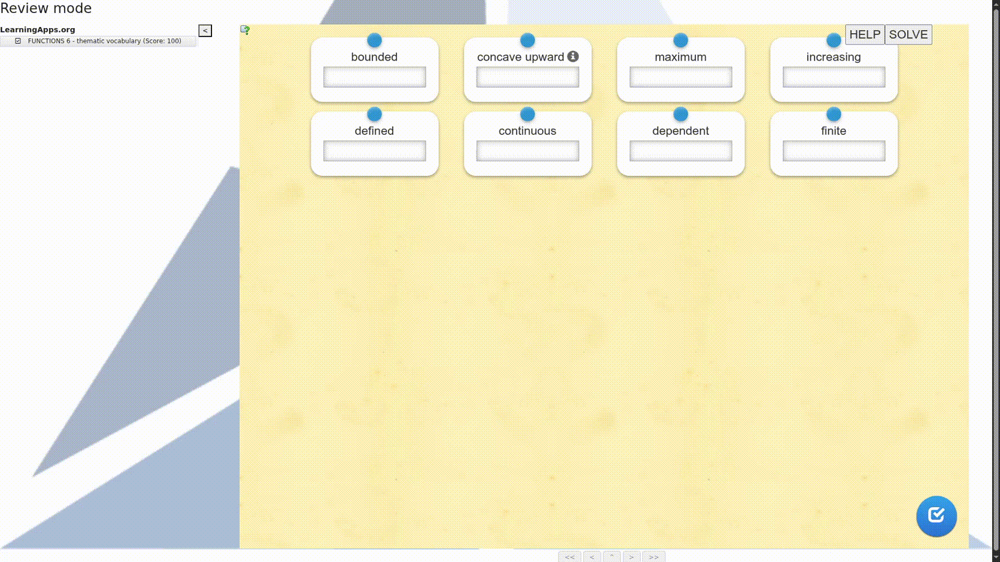
## Wybieranie z listy:
 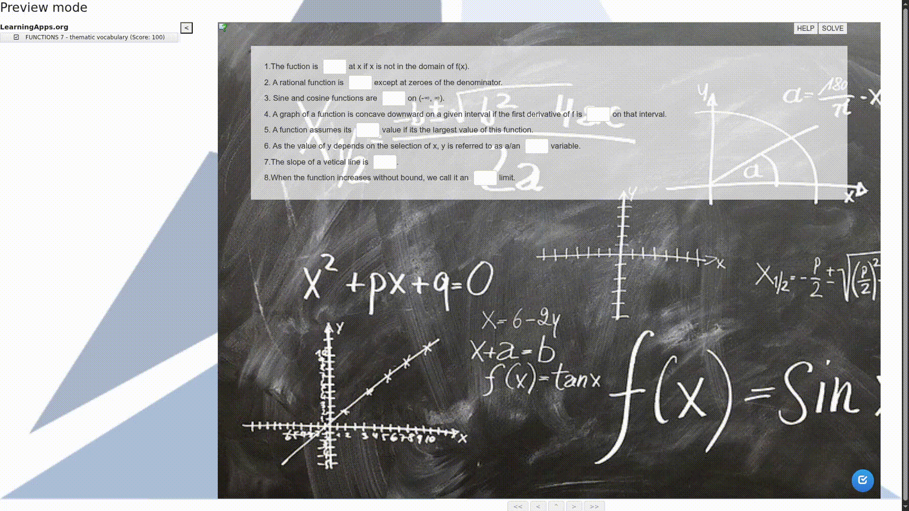
## Wisielec
 
# POMOC:
## Dopasowanie kart:
 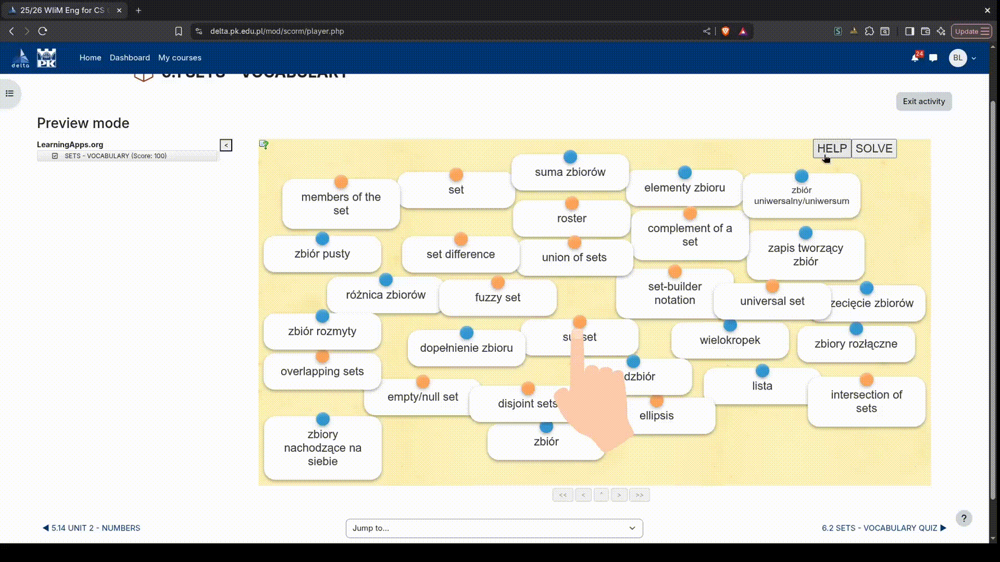
## Rozwiązanie quizu:
 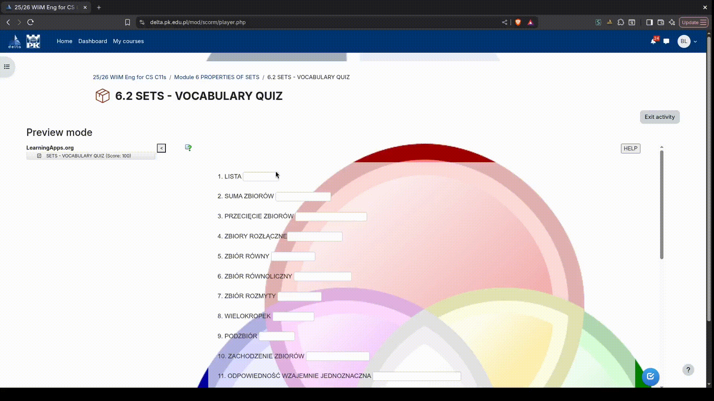
## Wordle:
 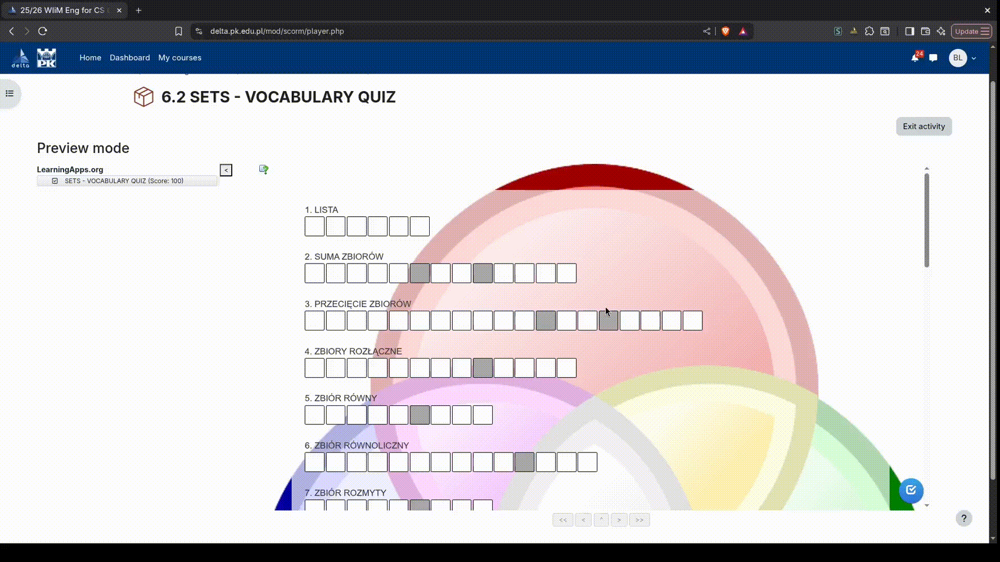
## Rozwiązywanie krzyżówki:
 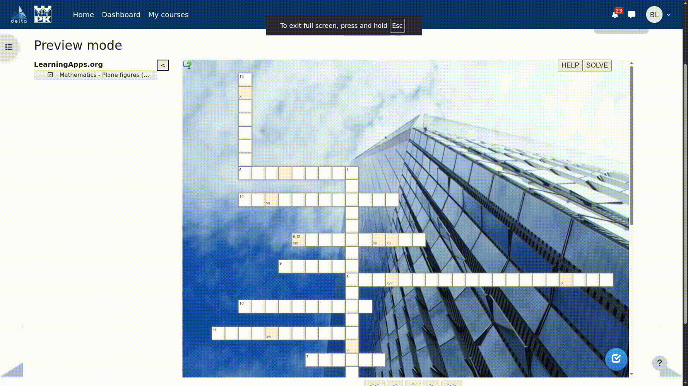
## Wisielec
 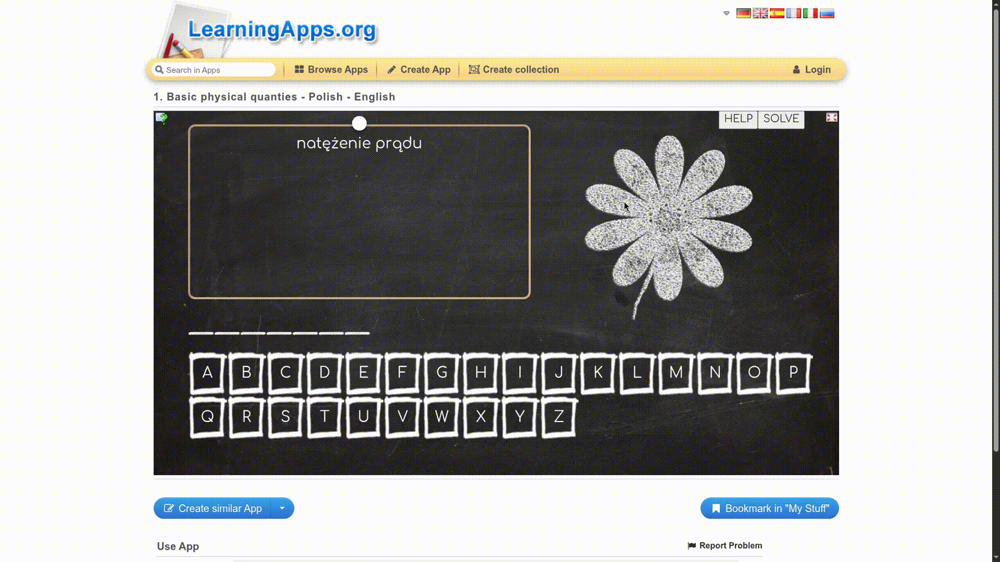

